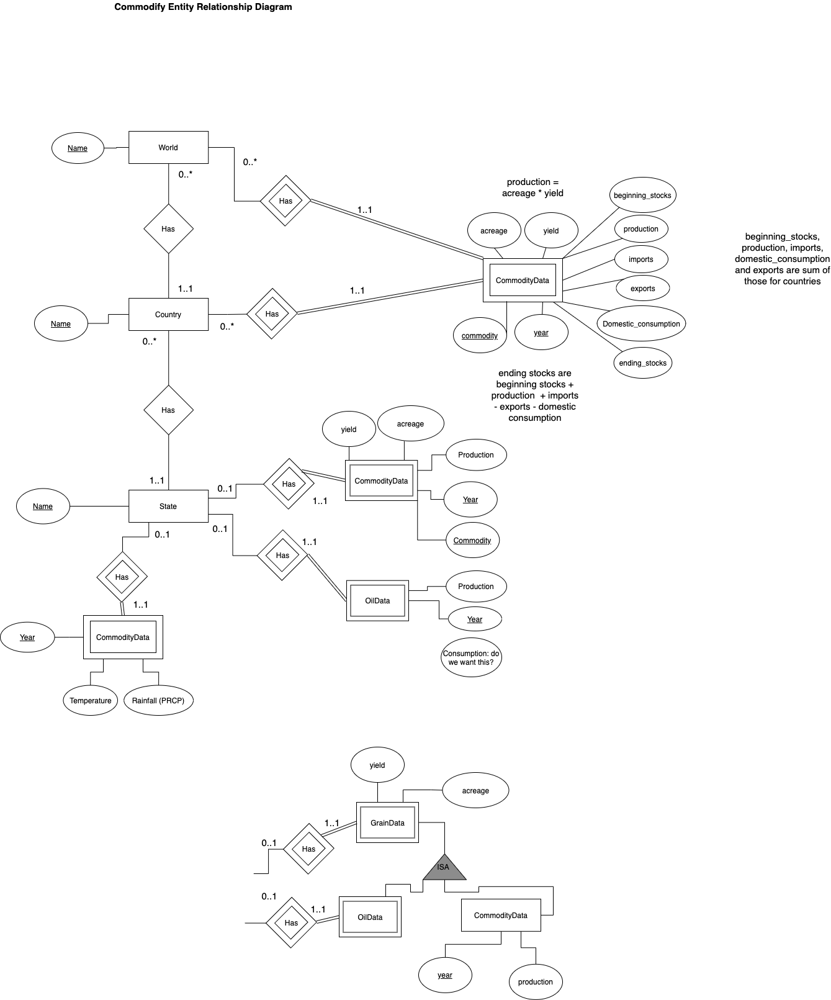

# Commodify

## CIS 550 Final Project Outline

### Motivation

We plan to build a database of commodity supply and demand statitistics. This will be augmented with features that allow the user to see the interaction between those variables and weather and climate, which are crucial determinants of commodity supply and demand. We will include functionality such as charts and maps to visualise the data.

Some online databases of supply and demand data already exist, such as the United States Department of Agriculture's "Production, Supply and Demand Online" tool, and the International Energy Agency's "Data Browser", available at the below links:

https://apps.fas.usda.gov/psdonline/app/index.html#/app/advQuery

https://www.iea.org/data-and-statistics?country=WORLD&fuel=Energy%20supply&indicator=TPESbySource

We plan to replicate some of the functionality of these sites. The user will be able to query historic and current data on commodity supply and demand to find, for example, production or consumption in a given region during a given period. However, our product will have several important features not available at any public website but potentially of considerable use to commodity analysts at banks, hedge funds and the like:

1. Data from multiple commodity sectors, i.e. not just agriculture or energy. This will facilitate cross-commodity analysis, for example comparison of differing rates of growth in consumption.
2. Our system will allow the user to enter their own estimates for certain statistics, e.g. 2021 US crude oil production, to see the implication for future inventories.
3. Graphics such as charts and maps.
4. Most importantly, it will also incorporate weather data, which as stated above is a vital driver of commodity supply and demand. Thus our product will facilitate data science concerning the impact of climate and weather on commodity markets.

### Features that will be implemented

We will have at least one page that allows the user to perform queries on historical and current commodity supply and demand statistics, as well as climate and weather data pertinent to those commodities. The user will also be able to enter their own estimates for some varibles to see the implications for future stock levels. There will also be a 'dashboard' page showing the most recent observations for various important commodity supply and demand and weather variables.

Initially we plan to include agricultural commodities, using various data from the US Department of Agriculture, and petroleum, using data from the US Department of Energy's Energy Information Agency. We Will include data for The United States as a whole and for individual states and regions of the United States.

The product will have graphics such as charts, for example the ability to chart production of a given commodity in different states.

### Features that might be implemented

If possible, we will extent the database to more commodities, such as natural gas and metals, and also international data.

More graphics such as maps.

Incorporation of prices into the database, allowing the user not only to explore the relationship between commodity supply and demand and climate, but also with market prices.

### High-level application design
The dashboard page will show a range of important statistics for commodities and the weather that affects those commodities. For the most part those statistics will be based on the most recent observations. The dashboard will be arranged by commodity, so for exmple there might be a corn section that shows predicted corn production, consumption and ending stocks for the current year and average rainall and precipitation relative to normal last month for the major corn-producing states.

The search page will initially show buttons allowing the user to select a commodity sector, for example 'grains', or 'petroleum'. After selecting one of these options the user will be presented with the option to search for country or state level data, and will then be shown drop-down menus for the data available. For example, these might be one drop-dowwn menu for states, one for commodity attributes (e.g. acreage or yield), and one for the period to be selected. The will also be the option to add weather data to the search, so for example the user might request to see annual average temperatures for the selected states. Once the 'Search' button is pressed, the user will see the requested data in tabular form, and, where possible, illustrated by charts and maps. For example, a request for US corn production for the years 2010 to 2020 might return such a bar chart. A search concerning US corn yields might show a map of the US with states coloured according to yield.

### Entity-relationship diagram



### SQL DDL for creating database
```
US_state(
    name varchar(14),
    PRIMARY KEY(name))
    
country(
    name varchar(30),
    PRIMARY KEY(name))
    
commodity_sector(
    name varchar(20),
    PRIMARY KEY(name))
    
commodity(
    name var_char(20),
    sector varchar(20),
    PRIMARY KEY(name),
    FOREIGN KEY sector REFERENCES commodity_sector(name))

state_grain(
    state varchar(14),
    year INT,
    commodity varchar(20),
    beginning stocks INT,
    acreage INT,
    yield DECIMAL(3,1),
    production INT,
    ending stocks INT
    PRIMARY KEY(state, year, commodity),
    FOREIGN KEY(state) REFERENCES US_state(name)
    FOREIGN KEY(commodity) REFERENCES commodity(name))
    
country_grain(
    country varchar(20),
    year INT,
    commodity varchar(20),
    beginning stocks INT,
    acreage INT,
    yield DECIMAL(3,1),
    production INT,
    imports INT,
    consumption INT,
    exports INT,
    ending stocks INT,
    PRIMARY KEY(country, year, commodity),
    FOREIGN KEY(country) REFERENCES country(name))
```
### Data cleaning plan

#### USDA Commodities Data

USDA data are highly scrutinised and we do not anticipate problems with erroeneous data.

1. Change column names to abbreviated snake case
2. Deal with null values, if any, by changing to zeros or removing the entry as appropriate.
3. Change commodity description values to be more human readable (e.g., "Animal Numbers, Cattle" -> "Cattle").
4. Create larger categories for commodities (e.g., "Cattle", "Swine", "Chickens" all go into "Livestock").

See `usda_preprocessing.ipynb` for implementation (WIP)

#### EIA Energy Data

1. 
2. 
3. 

See `eia_preprocessing.ipynb` for implementation (WIP)

#### NOAA Climate Data

1. This data comes in different .csvs for each year from 1929 to 2021 for each weather station located across the world, so these are first concatenated together.
2. Then, just the USA data is filtered out (by parsing and checking station location name) and data is grouped together by states.
3. Invalid placeholder values in the data (e.g. 9999.9, 999.9, 99.9) are replaced with N/A values
4. Only the features relevant to our application are retained, all other columns are dropped from the : 
    `['DATE','TEMP','DEWP','SLP','WDSP','MXSPD','GUST','PRCP','SNDP','FRSHTT','STATE']`
4. Finally, mean values per state by month are calculated, and this aggregated table is the final output of the cleaning.

See `noaa_preprocessing.ipynb` for implementation (done)

### Dependencies of application

- Backend: Node.js server with MySQL database hosted on AWS.

- Frontend: React.js with [`react-chartist`](https://gionkunz.github.io/chartist-js/) for plots and charts and [`react-leaflet`](https://react-leaflet.js.org/) for maps.

- Hosting: App deployed on [Netlify](https://netlify.com) using their [CI/CD](https://en.wikipedia.org/wiki/CI/CD) pipeline.

### Team member responsibilities

|       Name       | Main Responsibilities                       |
|:-----------------|:--------------------------------------------|
|Iris Tiong        |UX design; Backend implementation; Climate data     |
|Francis Featherby |App specs and design; Commodities data       |
|Peter Brice       |Database design and implementation; Petroleum data      |
|Steven Brooks     |Project management; Technology integration; Data visualization  |

