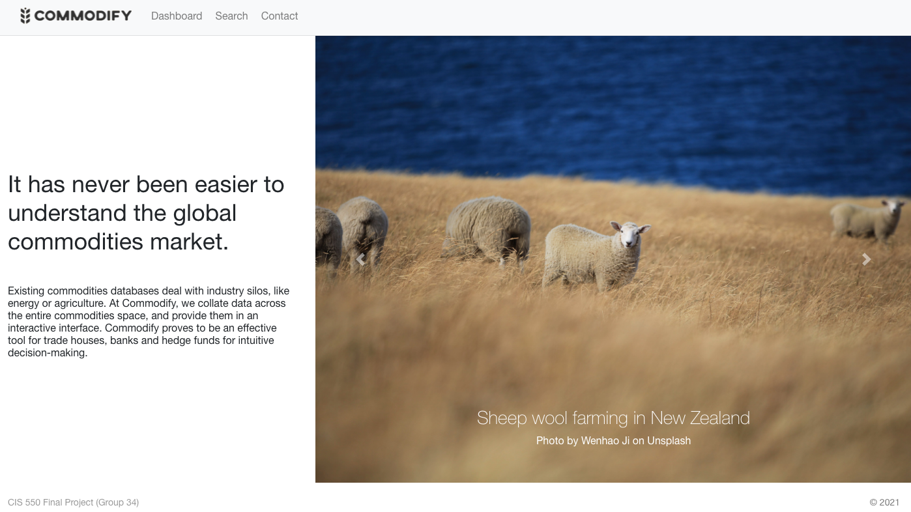
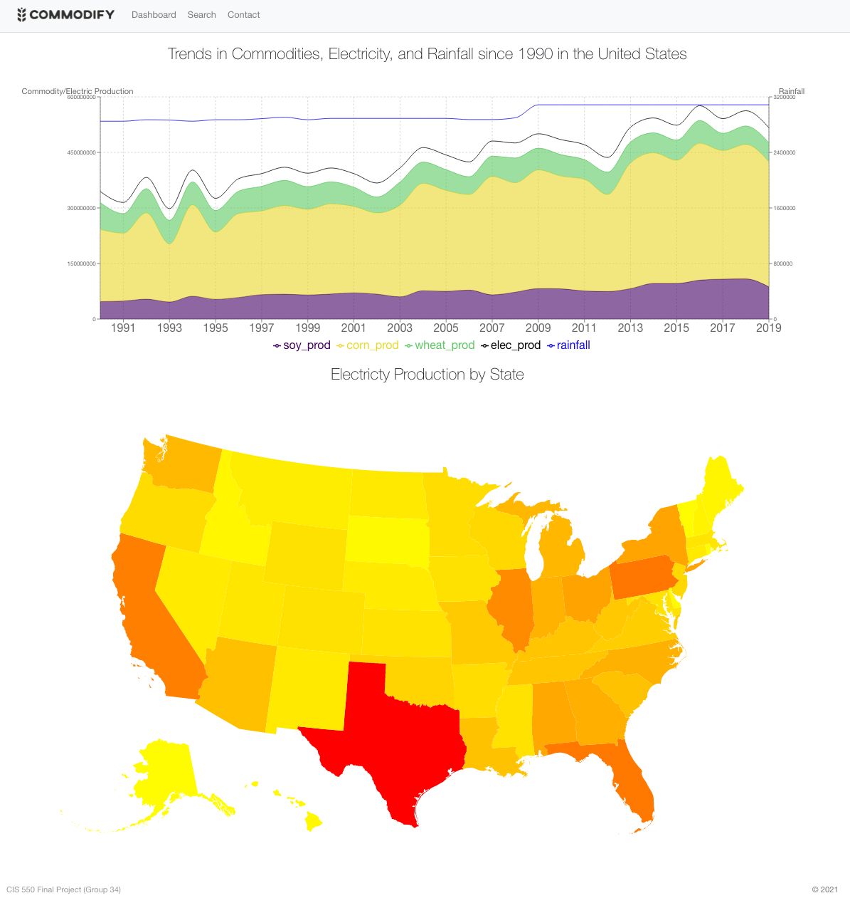
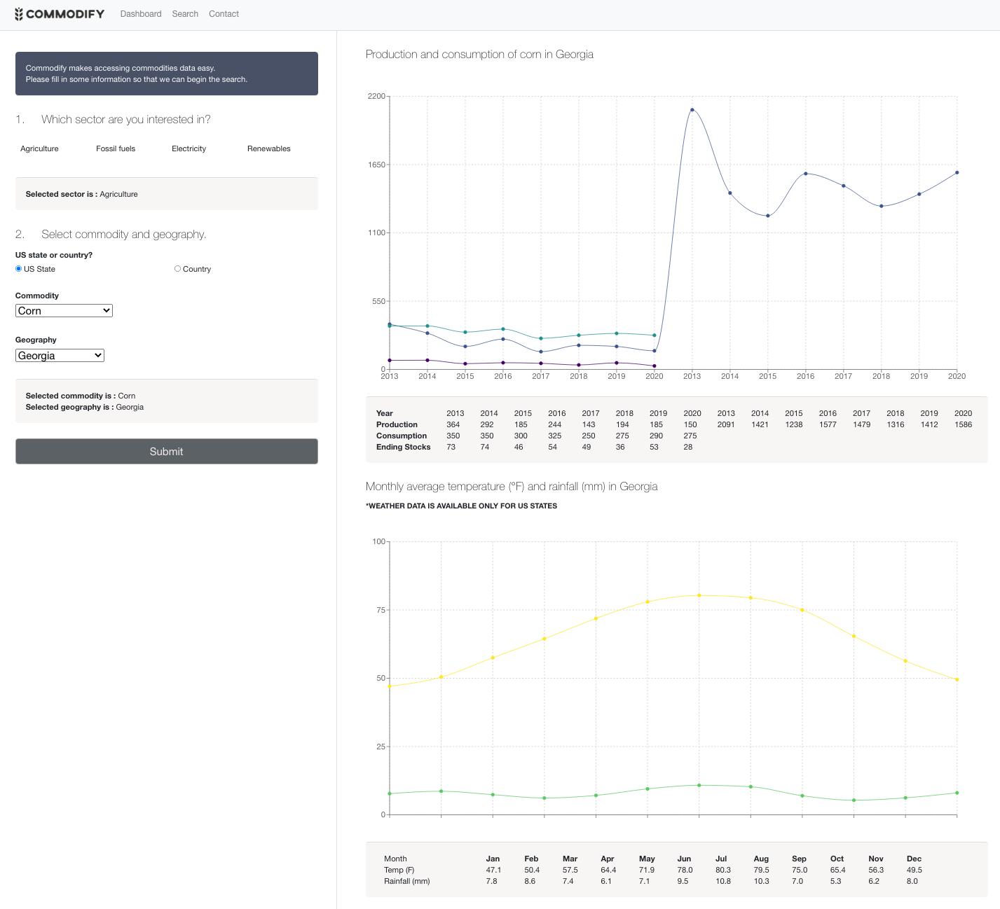

# Commodify

### Team Members

|       Name       |        Email          |   GitHub   |
|:-----------------|:----------------------|:-----------|
|Iris Tiong        |iristyx@seas.upenn.edu |iristyx     |
|Francis Featherby |ffrancis@seas.upenn.edu|ffeatherby  |
|Peter Brice       |pbrice@seas.upenn.edu  |briceybrit  |
|Steven Brooks     |sbr@seas.upenn.edu     |stevegbrooks|


## Introduction

Commodify is an app to visualize and interact with commodity market and weather data.

### The problem

Existing sources for commodity data deal mostly with individual sectors such as energy or agriculture, but rarely with the whole commodities space, and often with little analysis or interpretation. To get an overview of the entire market, one needs to manually integrate data from many different resources, which is time intensive and technically difficult for most traders and analysts. Commodify is the solution.

### The solution

Commodify provides a "one-stop-shop" for commodities and weather data, and aims to be a useful resource for trade houses, banks and hedge funds analysing and trading commodities - and the many other markets influenced by commodities.

## Architecture

The database was built in MySQL and hosted on AWS. The web application was developed using React, a user interface framework developed by Facebook. Using the Node package manager, a boilerplate application was swiftly set up via the Node package create-react-app. A list of dependencies (required Node modules) for the client is outlined in the json file "commodify/app/client/package.json". The professional look-and-feel anD responsivessness of the webpage was implemented using Bootstrap, an open-source CSS framework, which contains built-in templates for interface components such as navbars and grid layouts.

Python notebooks were used to do initial EDA and data processing. Libraries used included pandas and numpy.

Express, AWS --- add more elaboration

#### Homepage



Commodify allows the user to search for raw data on commodity supply and demand and also presents visualisations of that data. Furthermore, since weather and climate are crucial determinants of the supply and demand of many commodities, it returns weather data and charts relevant to the commodity search. This illustrates not only trends in the commodities markets, but also the interaction between weather and climate. The site has a homepage and two functional pages, a "Dashboard" and a "Search" page.

#### Dashboard

The dashboard page gives the user a overview of the commodities market in graphical display formats. For the purpose of the project, the information presented on this page is for the USA only, due to the fact the data is most complete and available for the USA. The page contains two charts: the first chart presents a broad overview of production levels of commodities (soy, corn and wheat are the major stocks in USA) and electricity. Total rainfall level is overlaid and presented on the same chart to illustrate the broad relationship between rainfall levels and commodity production levels, if any. The second chart presents the total electricity production of each of the 50 USA states, levels illustrated by the colors (with red being the highest, and light yellow being the lowest).



#### Search

The search page allows the user to select a commodity sector, for example 'agriculture', or 'renewables'. After selecting one of these options the user will be presented with the option to search for country or USA state level data, and will then be shown drop-down menus for the data available. Once the selections are made and the 'Submit' button is pressed, the user will see the commodity's production and consumption data in graphical display (line chart) and tabular form. Should the user select to view commodity data for a USA state (instead of country), an additional query is performed to retrieve weather information for the selected state. Monthly average rainfall and temperature data are then presented in a separate chart and tabular format below the first chart.



## Data

The datasets used in the application mainly agricultural commodities data, energy supply and demand data, as well as weather data obtained from public domains.

1. [Current and historical agricultural commodities data from the USDA Foreign Agricultural Service](https://apps.fas.usda.gov/psdonline/app/index.html#/app/downloads)

  * Description: a dataset containing commodities and their prices around the world, including trading value at the beginning and end of each month.

  * Size: ~200 MB with ~2 million rows and 12 features.

  * A commodity is identified by "Commodity_Code", and also has location, time, and various attributes attached to its value.
  
  * A quick peek at the first 5 rows of the data shows the following (column names changed for brevity; not all columns shown): 
  
	| ccode | comm | cntry | mrkt_yr | year | month | attr_id | attr | unit_id | unit_desc | val |
	|:----------|:----------|:-----------|:--------|:-----|:------|:--------|:----------|:---|:-----|:--|
	| 577400    | Almonds   | AF         | 2010    | 2018 | 10    | 20      | Beginning Stocks     | 21 | (MT) | 0 |
	| 577400    | Almonds   | AF         | 2010    | 2018 | 10    | 125     | Domestic Consumption | 21 | (MT) | 0 |
	| 577400    | Almonds   | AF         | 2010    | 2018 | 10    | 176     | Ending Stocks        | 21 | (MT) | 0 |
	| 577400    | Almonds   | AF         | 2010    | 2018 | 10    | 88      | Exports              | 21 | (MT) | 0 |
	| 577400    | Almonds   | AF         | 2010    | 2018 | 10    | 57      | Imports              | 21 | (MT) | 0 |

  * Number of unique values for each column (original column names):
  
	| col_name              |unique |
	|:----------------------|------:|
	| Commodity_Code        |    63 |
	| Commodity_Description |    63 |
	| Country_Code          |   212 |
	| Country_Name          |   213 |
	| Market_Year           |    62 |
	| Calendar_Year         |    62 |
	| Month                 |    13 |
	| Attribute_ID          |    71 |
	| Attribute_Description |    71 |
	| Unit_ID               |    11 |
	| Unit_Description      |    11 |
	| Value                 | 44725 |
	
  * Summary statistics for numeric columns:

	| Market_Year |Calendar_Year |   Unit_ID     |    Value        |
	|:------------|:-------------|:--------------|:----------------|
	|Min.   :1960 |Min.   :1959  |Min.   : 2.000 |Min.   :   -9510 |
	|1st Qu.:1979 |1st Qu.:2006  |1st Qu.: 8.000 |1st Qu.:       0 |
	|Median :1992 |Median :2006  |Median : 8.000 |Median :      15 |
	|Mean   :1992 |Mean   :2006  |Mean   : 9.833 |Mean   :   11937 |
	|3rd Qu.:2007 |3rd Qu.:2014  |3rd Qu.: 8.000 |3rd Qu.:     212 |
	|Max.   :2021 |Max.   :2021  |Max.   :29.000 |Max.   :42528700 |


2. For energy and electricty data: [Current and historical energy supply and demand data from the Energy Information Agency, part of the United States Department of Energy](https://www.eia.gov/petroleum/data.php), [Current and historical electricity supply and demand data from the Energy Information Agency, part of the United States Department of Energy](https://www.eia.gov/electricity/data/state/), and [Historical energy data from the Statistical Review of World Energy by BP](https://www.bp.com/en/global/corporate/energy-economics/statistical-review-of-world-energy/downloads.html)

  * Description: The EIA produces data sets released weekly and monthly which contain thousands of data points on US and global energy production and consumption. Two of the csv datasets which were used were: "Retail Sales of Electricity by State by Sector by Provider (EIA-861)" (analogous to consumption of electricity) and “Net Generation by State by Type of Producer by Energy Source (EIA-906, EIA-920, and EIA-923).” Total electricity consumption from "Sales to Ultimate Customers" in megawatthours by state by year was manually merged with total (from all energy sources) electricity production/generation into a single csv.
  
  * In addition, BP produces an annual report which contains a consolidated dataset, panel format, of annual production and consumption data of energy types for countries from 1965 to 2019. All values are in exajoule (EJ) except for crude oil which was converted from megatonnes using a conversion factor of 23.44(m)tonnes/EJ. This dataset was added to provide more country specific energy data, specifically data of consumption and production of Crude Oil, Coal, Natural gas and Renewable energy.

  * Size: the data are provided in various packages and formats, some overlapping, but there are at least hundreds of features per week in data stretching back decades, i.e. thousands of rows.

  * The data are mostly time series. They show various aspects of supply and demand, e.g. production, consumption, inventories etc., for a given geographical region, such as a state or country, on a sequence of dates of in a sequence of periods. For the final project, only production and consumption data by political identity, by year was used.
  
  * Below are some example lines from a CSV file dealing with US crude oil production in the lower 48 United States by month in 2020 in thousands of barrels (column names changed for brevity).
  
	|Date       | U.S. Prod | East Coast Prod | Florida Prod | New York Prod|
	|:----------|----------:|----------------:|-------------:|-------------:|
	|2020-06-15 |     313264|             1967|            69|            23|
	|2020-07-15 |     340152|             1968|           122|            23|
	|2020-08-15 |     328099|             2189|           122|            23|
	|2020-09-15 |     326114|             2309|           108|            23|
	|2020-10-15 |     323387|             2359|           113|            23|
	|2020-11-15 |     333721|             2180|           117|            23|

  * Summary statistics:
  
	|     Date                   |   US Prod     |East Cost Prod | Florida Prod  |New York Prod |
	|:---------------------------|:--------------|:--------------|:--------------|:-------------|
	|Min.   :1981-01-15 00:00:00 |Min.   :119208 |Min.   : 399.0 |Min.   :  35.0 |Min.   : 9.00 |
	|1st Qu.:1990-12-30 12:00:00 |1st Qu.:175752 |1st Qu.: 649.5 |1st Qu.: 174.5 |1st Qu.:19.00 |
	|Median :2000-12-15 00:00:00 |Median :212585 |Median : 861.0 |Median : 370.0 |Median :28.00 |
	|Mean   :2000-12-14 11:43:27 |Mean   :223392 |Mean   :1171.7 |Mean   : 511.4 |Mean   :33.37 |
	|3rd Qu.:2010-11-30 00:00:00 |3rd Qu.:263536 |3rd Qu.:1518.0 |3rd Qu.: 542.5 |3rd Qu.:35.50 |
	|Max.   :2020-11-15 00:00:00 |Max.   :396865 |Max.   :4243.0 |Max.   :3606.0 |Max.   :96.00 |

3. [Current and historical weather data from the US National Oceanic and Atmospheric Administration (NOAA) National Center for Environmental Information (NCEI)](https://www.ncei.noaa.gov/data/global-summary-of-the-day/access/)

  * Description: a dataset containing daily weather data for weather stations in the USA, including, from 1929 to the present (2021).

  * Size: ~ over 20 GB with 28 features, including temperature, dewpoint, surface elevation, rainfall, wind speed, etc. The full dataset was downloaded and relevant information was extracted. Only state, rainfall and temperature data were retained for simplicity and usefulness.
  
  * A quick peek at the first 5 rows of the data shows the following (column names changed for brevity; not all columns shown): 
  
	| Entity_id | Year | Month | Temperature | Precipitation | 
	|:----------|:-----|:------|:------------|:--------------|
	| 108       | 1931 | 1     | 30.35       | 70.96         | 
	| 108       | 1931 | 2     | 35.96       | 46.42         | 
	| 108       | 1931 | 3     | 43.77       | 35.48.        | 
	| 108       | 1931 | 4     | 10.00       | 10.00.        | 
	| 108       | 1931 | 5     | 12.90       | 12.90         | 

  * Number of unique values for each column (selected useful column):

	| col_name              |unique |
	|:----------------------|------:|
	| Entity_id	        |    53 |
	| Year		        |    91 |
	| Month                 |    12 |
	| Temperature           |  7524 |
	| Precipitation         |  5985 |

	
  * Summary statistics for numeric columns:

	|Entity_id   |   Year      | Temperature  |Precipitation  |
	|:-----------|:------------|:-------------|:-------------|
	|Min.   :1   |Min.   :1931 |Min.   :-10.2 |Min.   :0     |
	|1st Qu.:109 |1st Qu.:1960 |1st Qu.:41.06 |1st Qu.:2.9   |
	|Median :159 |Median :1981 |Median :56.54 |Median :10.58 |
	|Mean   :152 |Mean   :1980 |Mean   :54.82 |Mean   :17.84 |
	|3rd Qu.:197 |3rd Qu.:2001 |3rd Qu.:70.25 |3rd Qu.:30.35 |
	|Max.   :262 |Max.   :2021 |Max.   :94.20 |Max.   :87.55 |


## Database

The commodities data were sourced as txt and csv files and processed using python notebooks such as commodity_usda_state.ipynb in our submission. This removed problem values, made names and units consistent, dropped unwanted columns and so on. The processed data were output as csv files and then uploaded to the database via MySQL.

The database can be recreated using the DDL.sql file which links to the provided csv files.

The major entity resolution questions conerned how to deal with the problem that different commodites have different attributes (for example corn has acreage but electricity does not), and different data are available at the country and state levels, for example wheat production data are available by country and by US state, but wheat consumption is only available at the country level. We decided that the best solution for the user was to include all the commodities supply and demand data in a single table, called **Commodity**, meaning we avoided having many different tables with different attributes at the cost of having many null values in the table. The table is in BCNF. We achieved this by placing metadata, such as the sector each commodity belongs to (e.g. agriculture for soybeans), to a separate table called **Commodity_Group**, and also the **Political_Entity** table, which contains information about countries and US states, including their names and the id used in the **Commodity** table. (It was necessary to use ids rather than names because there is a country called Georgia and also a state!) We determined which territories to include and which versions of their names to use, which abbreviations, and their ids, manually in Excel. The **Commodity_Group** and **Political_Entity** tables are also in BCNF.

The weather data are held in a table called **Weather**, which is also in BCNF.

Entity resolution for the political entities was done manually within Excel to determine which countries/territories would be included, how to spell them, and how to match them together using the pe_id as the foreign key.

[insert ER Diagram as in milestone here]

Relation schema: 

  * Commodity (<ins>name</ins>, <ins>year</ins>, <ins>month</ins>, <ins>pe_id</ins>, beginning_stocks, ending_stocks, imports, exports, acreage, yield, production, consumption)

Total instances in Commodity: 177,457

  * Commodity_Group (<ins>name</ins>, group_name)

Total instances in Commodity_Group: 68

  * Political_Entity (<ins>id</ins>, name, is_country, abbrev, geo_id)

Total instances in Political_Entity: 269

  * Weather (<ins>pe_id</ins>, <ins>year</ins>,<ins> month</ins>, temp, rainfall)

Total instances in Weather: 50,136

Political Entity (pe_id) provides the foreign key between Commodity and Weather.

Normal form and justification: These five tables were chosen to minimize the number of joins needed in common queries of the database. For example, Commodity was not split into Agriculture and Non-agriculture tables even though only production and consumption data is populated for Non-agriculture commodities (the rest of the non-primary key values are null). 

[more to be added here]


## Queries

Building the search function involved devising numerous complex searches to ensure that at each stage of the selection process the user sees only options which will result in non-null results. For example, the following query ensures that once the user has selected a commodity sector and whether they want state or country-level data, they will only be able to choose from commodities for which the database holds data for some of the relevants attributes in 2019 (the last year with full data available):

  SELECT DISTINCT C.name
  FROM Commodity C JOIN Political_Entity P ON C.pe_id=P.id JOIN Commodity_Group G ON C.name = G.name
  WHERE P.is_country='${eT}' AND C.year=2019 AND G.group_name='${sector}' AND ((C.production != 0 OR C.production != null)
    OR (C.consumption != 0 OR C.consumption != null) OR (C.ending_stocks != 0 OR C.ending_stocks != null))
  ORDER BY C.name ASC;
    
 Likewise, the below query returns a list of only those states or countries for which there is data for 2019 for one of the relevent attributes for the commodity previously selected:
 
  SELECT name
  FROM Political_Entity
  WHERE is_country = '${eT}' and name IN (
    SELECT DISTINCT P.name
    FROM Commodity C JOIN Political_Entity P ON C.pe_id=P.id
    WHERE C.name = '${commodity}' AND ((C.production != 0 OR C.production != null)
      OR (C.consumption != 0 OR C.consumption != null) OR (C.ending_stocks != 0 OR C.ending_stocks != null)));
 
 
 Once a commodity and state or country have been selected, the below query returns the relevant production, consumption and ending stock data for recent years:
 
  SELECT C.year, C.production, C.consumption, C.ending_stocks
  FROM Commodity C JOIN Political_Entity P on C.pe_id = P.id
  WHERE C.name = '${commodity}' and P.name = '${entity}' AND C.year > 2012;
  
Finally, if the user selected a state, the below query returns climate data for that state, specifically average tempereature and rainfall for each month, based on data for the last fifty years:

  SELECT month, AVG(temp) AS temp, AVG(rainfall) AS rainfall
  FROM Weather W JOIN Political_Entity P ON W.pe_id=P.id
  WHERE P.name = '${state}' and W.Year > 1970
  GROUP BY month
  ORDER BY month ASC;

The above queries completed in a satisfactory time.

The Dashboard page used the following queries to obtain the data needed for the chart:


```
SELECT C.year,
  SUM(IF(C.name ='Oilseed, Soybean', production, NULL )) AS soy_prod,
  SUM(IF(C.name='Corn', production, NULL )) AS corn_prod,
  SUM(IF(C.name='Wheat', production, NULL )) AS wheat_prod,
  ROUND(SUM(IF(C.name='Electricity', production, NULL ))/100000) AS elec_prod,
  ROUND(SUM(W.rainfall)) AS rainfall
FROM commodify.Commodity C 
  JOIN commodify.Political_Entity PE ON C.pe_id = PE.id
  JOIN commodify.Weather W ON PE.id = W.pe_id
WHERE C.year < 2020 AND C.year >= 1990 AND PE.is_country = 0 
GROUP BY C.year;
```

#### Benchmarking

We used the following to assess the performance of the original query:

```
set profiling=1;
FLUSH STATUS;
SELECT sql_no_cache ORIGINAL_QUERY;
SHOW profile;
```

Which showed us the following (average of 10 runs):

| Status	         | Duration |
|:-------------------|:--------:|
|Opening tables|	0.000616|
|init|	0.000008|
|System lock|	0.00001|
|optimizing|	0.000019|
|statistics|	0.000061|
|preparing|	0.000031|
|Creating tmp table|	0.000042|
|executing|	4.651374|
|end|	0.000013|
|query end|	0.000005|

Clearly, the most expensive thing is the actual execution. 

To look at number of page I/Os, we used:

```
FLUSH STATUS;
SELECT sql_no_cache ORIGINAL_QUERY;
SHOW STATUS LIKE 'last_query_cost';
```

Which showed us that there are around 200,000 page reads for this query.


#### Optimization

- Instead of using `Commodity.year` for the selection and grouping, we used `Weather.year`.
    
    - Commodity is a much bigger table: about 175,000 rows vs. 50,000 rows.
    
    - This reduced the page reads by half, but did not affect the query speed.

- We then investigated further and found that we only have Commodity data *by year* in the US, but we have Weather data *by month*. So when the JOIN happens, it basically does a cartesian product of the cardinality of `Commodity` times the cardinality of `Weather`. The solution then became obvious - use a subquery for Weather that groups it by year before the the JOIN:

        ```
        SELECT W.year,
            SUM(IF(C.name ='Oilseed, Soybean', C.production, NULL )) AS soy_prod,
            SUM(IF(C.name='Corn', C.production, NULL )) AS corn_prod,
            SUM(IF(C.name='Wheat', C.production, NULL )) AS wheat_prod,
            ROUND(SUM(IF(C.name='Electricity', C.production, NULL ))/100000) AS elec_prod,
            W.rainfall AS rainfall
        FROM (SELECT * FROM (
                SELECT year, ROUND(SUM(rainfall)) AS rainfall
                FROM commodify.Weather
                GROUP BY year
                ) AS wby
            ) AS W
            JOIN commodify.Commodity C ON W.year = C.year
            JOIN commodify.Political_Entity PE ON PE.id = C.pe_id
        WHERE PE.is_country = 0
        GROUP BY C.year;
        ```
    
    - The page reads fell to just over 5,000, and the query time fell to around half a second - a 10x improvement.

Below is the profile table after making the optimization (average of 10 runs):

| Status	         | Duration |
|:-------------------|:--------:|
|Opening tables|	0.000091|
|init|	0.000007|
|System lock|	0.000009|
|optimizing|	0.000004|
|statistics|	0.000017|
|preparing|	0.000010|
|Creating tmp table|	0.000029|
|executing|	0.055620|
|end|	0.000012|
|query end|	0.000005|

## Technical challenges

Perhaps the greatest challenge was formatting the website, including building the .css style files and getting user interfaces such as buttons and dropdown menus to function correctly. We struggled, for example, to to get data to render in rows rather than a single column. Without much experience of web design or any obvious single resource for guidance we resorted to a lot of googling (often unsuccesfully) and trial and error.
